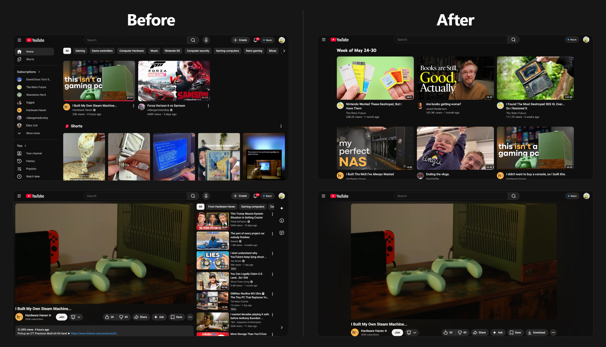

# BetterFeed

## Control your content. Kill doomscrolling.

BetterFeed is a Chrome extension that replaces YouTube's algorithmic, infinite
homepage with a small, **static** custom home page that only refreshes when you decide.

You see the same videos until your scheduled refresh, so that **you can discover new
videos without all of the doomscrolling traps.**

## AI Usage Disclaimer
To be completely transparent: **all** of this code was written using Claude Code Opus 4.7. I am not a web developer or software engineer — I work as a digital verification engineer and I understand web development to a certain degree, but truthfully, not to this level — *and* I am also extremely skeptical of and have a lot of very strong opinions about AI.

I am also, however, very bothered by the fact that we have been unwittingly manipulated by massive social media and entertainment conglomerates that make money off of us by using psychological tricks to suck us in to spending unhealthy amounts of *our* time on their platforms.

I know that there is a big level of hypocrisy in criticizing big tech while also using their AI tools. I can confidently say that it does not feel good to use AI to create a program like this, where I haven't learned how to program using JavaScript or anything along the way. My hope is, at least, that this will be useful for those of us who want to be intentional in the way that we spend our time.

This whole project is completely open-source and free under the GPLv3 license, and I would be very happy if others were to contribute and, hopefully, create something even better out of this.

Below is the actual README, now that I have gotten my schpiel out of the way.

---
## BetterFeed Extension Screenshots



## Highlights

- **Static home page -** Pick a day and time to refresh; until then the home page doesn't change.
- **Three refresh cadences -** Weekly, multiple days per week, or daily.
- **Distraction cleanup -** Hide Shorts, watch-page recommendations, end-screen cards, autoplay, live chat, side panel, comments, notification bell, mix/radio playlists,
  voice search, Create button, Explore/Trending, and more.
- **Daily watch limit -** Cap by video count, watch-time, or both. Grace 
  ("5 more minutes" or "finish this video" for example) when you hit your set limit.
- **Modes -** Switch between Watch (your custom home page with your set daily-limit), Work (distraction-free work mode), and Listen (coming soon; a music listening mode).
- **Work session lock -** Optionally commit to a session length; bailing out
  requires typing an unlock code.
- **Watching lock -** Once you've started watching for the day, the Refresh and Daily
  Limit settings lock behind the same unlock-code challenge so you can't
  impulsively raise the limit mid-binge.
- **Cross-device sync -** Settings, custom home page, hidden items, watched videos,
  and video progress all sync.
- **Free, open source, GPLv3-licensed.**

---

## Install

### From source — Chrome / Brave / Edge / any Chromium browser

1. Clone or [download](https://github.com/IBN-5100-tan/BetterFeed-Chrome-Extension/archive/refs/heads/main.zip) this repo.
2. Open `chrome://extensions`.
3. Toggle **Developer mode** on (top right).
4. Click **Load unpacked** and choose the folder **BetterFeed-Chrome-Extension-main**.
5. The welcome page should open where you can configure settings and head to `youtube.com`.

### From source — Firefox (121 or newer)

1. Clone or [download](https://github.com/IBN-5100-tan/BetterFeed-Chrome-Extension/archive/refs/heads/main.zip) this repo.
2. Open `about:debugging#/runtime/this-firefox`.
3. Click **Load Temporary Add-on…** and select the `manifest.json` file inside **BetterFeed-Chrome-Extension-main**.
4. Visit `youtube.com`.

Temporary add-ons are unloaded when you restart Firefox; reload with the
same dialog. A signed release on addons.mozilla.org (AMO) is planned.

> **Note on cross-browser sync.** Chrome's `chrome.storage.sync` and Firefox's
> are separate ecosystems — settings, weekly grid, and hidden items do not
> sync between, say, Chrome on your laptop and Firefox on your phone. Within
> a single browser family (e.g., Chrome on two laptops, or Firefox on two
> laptops), sync works the same way.

### From the Chrome Web Store / Firefox Add-ons

> Not yet published on either. See [CONTRIBUTING.md](CONTRIBUTING.md#publishing-to-the-chrome-web-store)
> for the publish flow used by maintainers.

---

## Usage

### Modes

The first time you load YouTube, BetterFeed asks which mode to enter:

| Mode    | What it does                                                         |
|---------|----------------------------------------------------------------------|
| Watch   | Static custom home page. The default; lets you watch videos.         |
| Work    | Search-only. Hides every grid, sidebar entry, and recommendation.    |
| Listen  | Coming soon. To have music recommendations so you can discover new music and no daily limit so that you can listen to music while you work. |

Switch modes anytime via the **mode switcher button** in the YouTube masthead next to your profile icon.

### Refresh schedule

Configured under **Settings → Refresh**:

- **Weekly.** Refreshes once a week.
- **Multiple days per week.** Refreshes on any combination of days per week.
- **Daily.** Refreshes once a day.

On a refresh, the extension fetches YouTube's home page in the background (a
plain HTTP request, no tab navigation), reads a fresh set of recommendations
from it, and stores them as your new home page. Until the next refresh you are
always redirected to and stay on the custom URL
(`youtube.com/feed/library#better-feed-watch`), **NOT** `youtube.com`, so
YouTube's algorithm doesn't get messed up.

### Daily limit

Configured under **Settings → Daily limit**. Three modes:

- **Videos.** Cap by number of videos watched.
- **Time.** Cap by total watch time.
- **Both** (default). Whichever limit hits first.

When you hit the limit, BetterFeed shows a "see you tomorrow" takeover.
A popup offers choices like **5 more minutes** or **finish this video** for example.

### Hidden items

Click the three dots on a video card and choose **Hide video** or **Hide channel** to suppress
videos / channels from future home pages. Restore them from the popup
(BetterFeed's chrome extension icon) or **Settings → Hidden videos**.

### Work session lock

Entering **Work mode** automatically *locks* **Watch mode** for 20 minutes minimum,
or for a length of time that you choose, so that you don't impulsively try to watch videos 
while you are trying to get work done. Until the lock timer ends,
you will be required to type in an **unlock code** if you want to enter **Watch mode** early. The friction is intentional to help keep you on track by making you stop and think for a moment.

### Watching lock

Once you've started watching videos for the day, the **Refresh schedule** and
**Daily limit** settings lock to keep you from impulsively changing and ignoring them. 

---

## Permissions

| Permission                | Why                                                                        |
|---------------------------|----------------------------------------------------------------------------|
| `storage`                 | Persist settings, the custom home page, hidden items, watched videos.      |
| `declarativeNetRequest`   | Redirect `youtube.com/` to the marker URL where the home page is rendered. |
| `alarms`                  | A 5-minute timer that re-checks whether a refresh is now due.              |
| `*://www.youtube.com/*`   | The only host the content scripts and redirect rule touch.                 |

The extension only contacts `youtube.com` (and its CDN `i.ytimg.com`
for thumbnail images) — `oembed` for titles and channel names, watch
pages for view count / duration / publish date, and channel pages for
the channel avatar. No third-party servers, no analytics, no telemetry.
See [PRIVACY.md](PRIVACY.md) for the full data-flow breakdown.

---

## Storage model

Two storage areas:

- **`chrome.storage.local`** (per-device) — full state: settings, custom home page, 
  hidden lists, watched videos, per-video playback progress,
  daily-state counters, work session.
- **`chrome.storage.sync`** (cross-device) — a slim subset: settings, the
  home page videos as ID-only, hidden lists, watched videos, and per-video
  positions. Other devices rebuild missing metadata via YouTube's oEmbed
  endpoint.

When sync changes, [`applySyncChangeToLocal`](shared.js) reconciles the
two using a "newer wins for settings and home page content, set-union for hidden
and watched lists, max-position wins for progress" strategy.

See [ARCHITECTURE.md](ARCHITECTURE.md) for the full data flow.

---

## Project layout

```
manifest.json    Chrome MV3 manifest. Lists permissions, content scripts,
                 the service worker, the popup, the options page, and the
                 web-accessible welcome page.

background.js    Service worker. Owns the dNR redirect rule and the
                 5-minute refresh-check alarm.

early.js +       Runs at document_start. Adds mode classes to <html> so
preload.css      preload.css can hide the native home / sidebar / app shell
                 before YouTube paints.

shared.js        Constants, settings schema, storage helpers, sync logic.
                 Loaded by every other script.

content.js       Everything users see on a YouTube tab:
                 the custom home page, mode picker, daily limit, work sessions, etc. 
                 See its top-of-file header for the section index.

options.html +   The full-tab options page (Refresh, Cleanup, Daily limit,
options.js       Hidden, Advanced, Debug).

popup.html +     The toolbar popup. Two buttons: Settings, Hidden Items.
popup.js

welcome.html +   Shown once on first install. Hero + before/after images +
welcome.js       feature list + CTA.

pictures/        Welcome-page screenshots and icons.
```

---

## Contributing

See [CONTRIBUTING.md](CONTRIBUTING.md) for dev setup, debug tools, code
organization, and the Chrome Web Store publish flow.

Architecture details (storage model, the refresh pipeline, the mode +
session state machines) live in [ARCHITECTURE.md](ARCHITECTURE.md).

---

## License

BetterFeed is licensed under the **GNU General Public License v3.0 or later**.
See `LICENSE` for the full text. Anyone is free to use, modify, and
redistribute it under the same terms.

## Contact

For any questions or inquiries, please feel free to email me at hououinkyo@proton.me.
